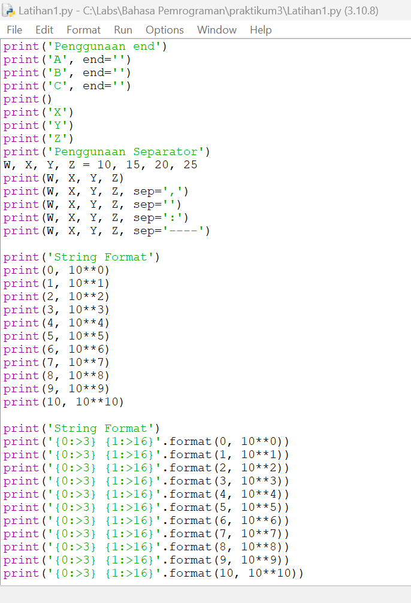
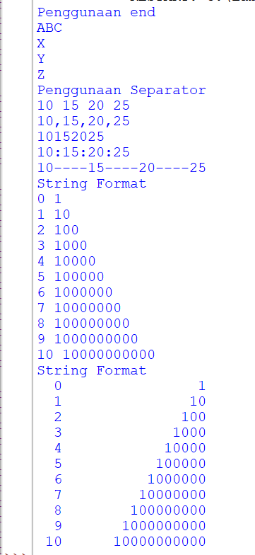
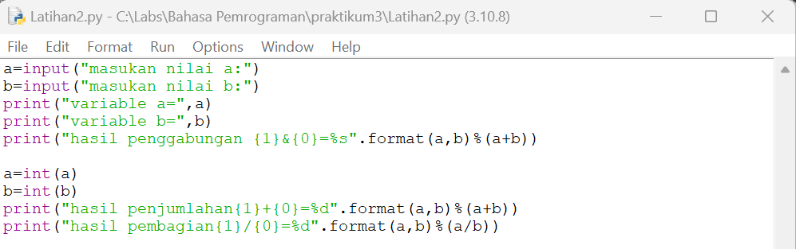
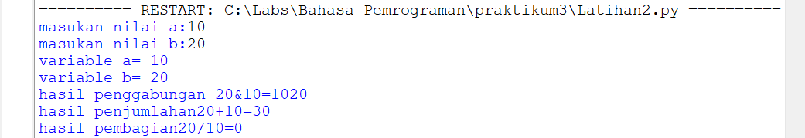
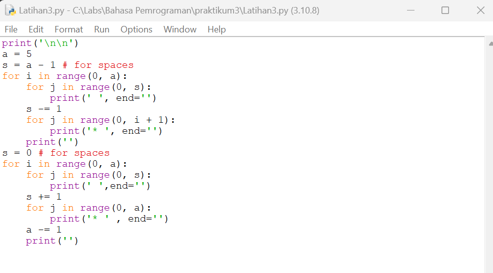
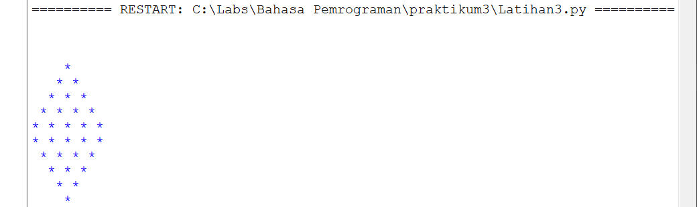

# Praktikum3

## Latihan 1

## Hasil Latihan 1

## Latihan 2

## Hasil Latihan 2

### FYI jika TypeError: %d format: a number is required, not str" Jika args adalah daftar atau tupel, %s dapat digunakan sebagai pengganti dalam kueri. Jika args adalah dict, %(name)s dapat digunakan sebagai placeholder dalam kueri.

## Latihan 3

## Hasil Latihan 3

## Luas Dan Keliling Lingkaran

## Hasil Luas Dan Keliling Lingkaran

## Flowchart Luas Dan Keliling Lingkaran
